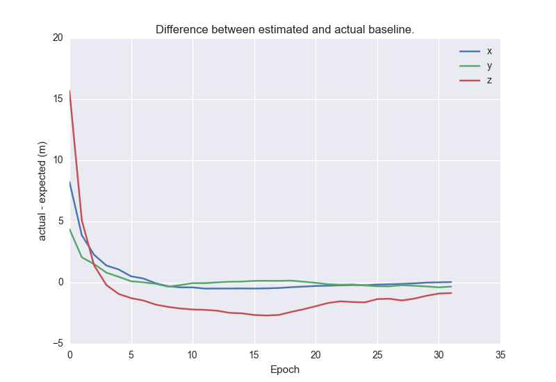

# gnss-analysis

master: [](https://travis-ci.org/swift-nav/gnss-analysis)

Tools for analyzing libswiftnav filters on stored GNSS data.

# Setup and install

First, you need to install

 - [libswiftnav](https://github.com/swift-nav/libswiftnav/)
 - [hdf5](https://www.hdfgroup.org/HDF5/)(required for `tables`)

After which you can install gnss-analysis and the rest of its dependencies by running:

```shell
pip install -r ./requirements.txt
pip install -e ./
```

Note that `pip install -r ./requirements.txt` will install the bleeding edge
libswiftnav.  If you want to run against a different version you can do so by
manually installing `libswiftnav/python` after completing installation.

## Virtual Environments

`gnss_analysis` requires `numpy`, `pandas` and `scipy` all
of which need to be specific versions and can cause compliation
nightmares.  You may find it easier to install into a conda
virtual environment,
```shell
conda create -n gnss_analysis numpy==1.9.3 scipy==0.16.0 cython matplotlib pandas==0.16.1
source activate gnss_analysis
```
which will get you most of the way after which you can follow the standard install above.

# Usage

```python
import os
import sys
import numpy as np
import seaborn as sns
import matplotlib.pyplot as plt

from gnss_analysis import filters
from gnss_analysis import solution
from gnss_analysis.io import simulate

# load a set of observations, each observation set
# holds any available rover, base and ephemeris data
# for a given epoch.
rover_file = 'tests/test_data/short_baseline_cors/seat032/seat0320.16o'
nav_file = 'tests/test_data/short_baseline_cors/seat032/seat0320.16n'
base_file = 'tests/test_data/short_baseline_cors/ssho032/ssho0320.16o'
# see also: simulate_from_log and simulate_from_hdf5
# which allow reading from different file formats.
obs_sets = simulate.simulate_from_rinex(rover_file,
                                        navigation=nav_file,
                                        base=base_file)
# define the filter you want to run
dgnss_filter = filters.StaticKalmanFilter()
# Then actually run the filter using the observations.
# The list of solutions consists of a solution for each
# epoch.  Each solution consists of the observation_set
# with additional fields corresponding to single point
# and DGNSS positions.
solutions = list(solution.solution(obs_sets, dgnss_filter))
# we can then investigate the results

def compute_baseline_error(soln):
  # extract the rover position for the current epoch
  rover_pos = np.array([soln['rover_info']['x'],
                        soln['rover_info']['y'],
                        soln['rover_info']['z']])
  # extract the base position for the current epoch
  base_pos = np.array([soln['base_info']['x'],
                       soln['base_info']['y'],
                       soln['base_info']['z']])
  # determine the expected baseline
  expected_baseline = rover_pos - base_pos
  # then the actual baseline from the filter
  actual_baseline = soln['rover_pos'][['baseline_x',
                                       'baseline_y',
                                       'baseline_z']].values[0]
  # and return the difference in the ECEF components
  return actual_baseline - expected_baseline

# collect all the baseline errors
errors = [compute_baseline_error(soln) for soln in solutions]
# and make a plot
sns.set_style('darkgrid')
plt.plot(errors)
plt.xlabel("Epoch")
plt.ylabel("actual - expected (m)")
plt.legend(["x", "y", "z"])
plt.title("Difference between estimated and actual baseline.")
plt.show()
```

Which would produce the following image:


You can run this yourself using `python examples/example_filter_run.py`,
or from the command line (see the *Running and Comparing Filters* section).

#Conversion

A large portion of the runtime for the example above will be parsing
the input and doing ephemeris computaitons.  To facilitate more rapid
analysis the piksi logs (and RINEX files) can be converted into HDF5
files using the `convert.py` script.

```
$ python gnss_analysis/tools/convert.py --help
usage: convert.py [-h] [--base BASE] [--navigation NAVIGATION]
                  [--output OUTPUT] [-n N] [--calc-sat-state] [--profile]
                  [--filter {static,dynamic}]
                  input

convert.py A tool for converting from a variety of different formats to HDF5,
with the option of precomputing satellite states or running a filter before
saving.

positional arguments:
  input                 Specify the input file that contains the rover (and
                        possibly base/navigation) observations. The file type
                        is infered from the extension, (SBP=".json",
                        RINEX="*o", HDF5=[".h5", ".hdf5"]) and the appropriate
                        parser is used.

optional arguments:
  -h, --help            show this help message and exit
  --base BASE           Optional source of base observations.
  --navigation NAVIGATION
                        Optional source of navigation observations.
  --output OUTPUT       Optional output path to use, default creates one from
                        the input path and other arguments.
  -n N                  The number of observation sets that will be read,
                        default uses all available.
  --calc-sat-state      If specified the satellite state is computed prior to
                        saving to HDF5.
  --profile
  --filter {static,dynamic}
```

For example we could run:
```shell
python tools/convert.py path_to_rover_file \
 --base path_to_base_file --navigation path_to_nav_file \
 --calc-sat-state --output observations.hdf5
```

Then replace the line above with:
```
obs_sets = simulate.simulate_from_hdf5('observations.hdf5')
```

which would run the same analysis as above, but should do so quicker (particularly if dealing with large files.)

# Running and Comparing Filters.

The `compare.py` script provides a commandline method for runing and evaluating
the performance of a single (or multiple) filters.  This is done by specifiying and
input set of observations (in much the same way as `convert.py`) and a filter name:

```
$ python gnss_analysis/tools/compare.py plot --help
usage: compare.py plot [-h] [--base BASE] [--navigation NAVIGATION]
                       [--output OUTPUT] [-n N]
                       [--filters [{L1_dynamic,multiband_dynamic,multiband_static,swiftnav,L1_static} [{L1_dynamic,multiband_dynamic,multiband_static,swiftnav,L1_static} ...]]]
                       [--draw-every DRAW_EVERY]
                       input

positional arguments:
  input                 Specify the input file that contains the rover (and
                        possibly base/navigation) observations. The file type
                        is infered from the extension, (SBP=".json",
                        RINEX="*o", HDF5=[".h5", ".hdf5"]) and the appropriate
                        parser is used.

optional arguments:
  -h, --help            show this help message and exit
  --base BASE           Optional source of base observations.
  --navigation NAVIGATION
                        Optional source of navigation observations.
  --output OUTPUT       Optional output path to use, default creates one from
                        the input path and other arguments.
  -n N                  The number of observation sets that will be read,
                        default uses all available.
  --filters [{L1_dynamic,multiband_dynamic,multiband_static,swiftnav,L1_static} [{L1_dynamic,multiband_dynamic,multiband_static,swiftnav,L1_static} ...]]
  --draw-every DRAW_EVERY
                        The number of epochs between plot refreshes,
                        refreshing every iteration (1) significantly slows
                        down the script. A value of zero (or less) will wait
                        until all observations were processed before creating
                        the plot. Default is 10
```

For example you can run the static Kalman filter on the example data set by running,
```
python gnss_analysis/tools/compare.py tests/test_data/short_baseline_cors/seat032/seat0320.16o \
  --base tests/test_data/short_baseline_cors/ssho032/ssho0320.16o \
  --filters static
```

This should be sufficiently fast for a quick comparison, but you'll find most of the runtime
is spent parsing the observation file.  To sped up the comparison you could first convert to HDF5,
```
python gnss_analysis/tools/convert.py tests/test_data/short_baseline_cors/seat032/seat0320.16o \
  --base tests/test_data/short_baseline_cors/ssho032/ssho0320.16o \
  --output short_baseline_cors.hdf5 --calc-sat-state
```
Then run the filter using the HDF5 file.
```
python gnss_analysis/tools/compare.py short_baseline_cors.hdf5 --filters static
```

In addition to visual plots of the filter's performance you can compute summary statistics of one or more filters by using `python gnss_analysis/tools/compare.py stats`.

# Downloading & Converting SITL data
SITL datasets are stored in [S3](https://console.aws.amazon.com/s3/home?region=us-east-1#&bucket=estimation-sitl-data&prefix=multiband-datasets/).
To download all datasets:
```
cd gnss_analysis/tools
./download_sitl_data.sh
```
To convert a new CORS dataset and upload to S3:
```
cd gnss_analysis/tools
./convert_sitl_data.sh -r "cebr" -b "vill" -d "049" -h "23" -m "00" -y "2016"
```
